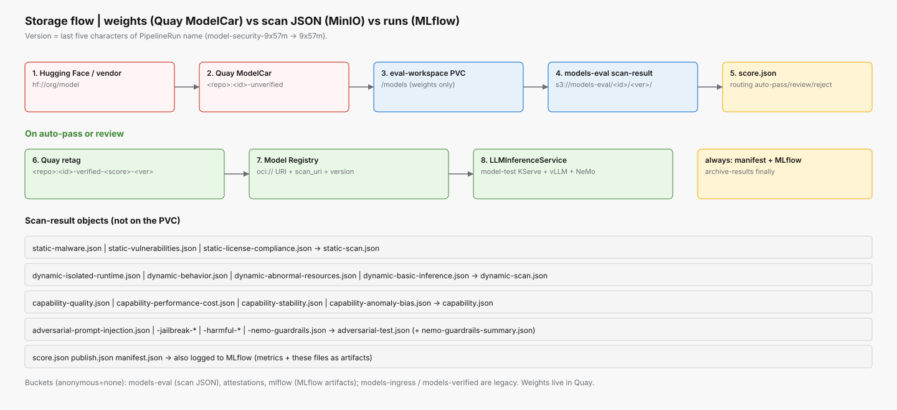

# Storage and registry

**MinIO overlay:** [`overlays/05-storage`](../overlays/05-storage)  
**Buckets:** created by [`instances/minio/bucket-init-job.yaml`](../instances/minio/bucket-init-job.yaml)



*Weights are ModelCar OCI images. Scan JSON stays in MinIO. Version is the last five characters of the PipelineRun name.*

## What lives where

| Asset | Store | Namespace | Notes |
|-------|-------|-----------|-------|
| Scanner images | Internal registry / Quay | `build-image` | Not model weights |
| Untrusted weights | Quay ModelCar `:unverified` | OCI | Built by `model-fetch` Job |
| Eval workspace | PVC `eval-workspace` | `model-eval` | `/models` extracted from `:unverified` for static scans |
| Scan JSON | MinIO `models-eval/<model-id>/<version>/scan-result/` | S3 | Per-subtask + merges + `score.json` |
| Verified weights | Quay ModelCar `:verified-score-build<version>` | OCI | Publish retag on auto-pass or review |
| Attestations | MinIO `attestations/` | S3 | Tekton Chains target |
| Serving pointer | RHOAI Model Registry | `rhoai-model-registries` | `storage_uri` = `oci://…` |

Buckets `models-ingress` / `models-verified` may still exist from older installs; the pipeline no longer writes weights there.

## Version key

PipelineRun `model-security-9x57m` → version `9x57m` → tag `verified-score-build9x57m`.

```text
s3://models-eval/<model-id>/9x57m/scan-result/*.json
oci://quay.io/<org>/modelcar-<model-id>:verified-score-build9x57m
```

## Object names in `scan-result/`

| Writer | Object |
|--------|--------|
| Static subtasks | `static-malware.json`, `static-vulnerabilities.json`, `static-license-compliance.json` |
| Static merge | `static-scan.json` |
| Dynamic subtasks | `dynamic-isolated-runtime.json`, `dynamic-behavior.json`, `dynamic-abnormal-resources.json`, `dynamic-basic-inference.json` |
| Dynamic merge | `dynamic-scan.json` |
| Capability subtasks | `capability-quality.json`, `capability-performance-cost.json`, `capability-stability.json`, `capability-anomaly-bias.json` |
| Capability merge | `capability.json` |
| Adversarial subtasks | `adversarial-prompt-injection.json`, `adversarial-jailbreak-guardrail-bypass.json`, `adversarial-harmful-content-bias.json` |
| Adversarial merge | `adversarial-test.json` |
| Score gate | `score.json` |
| Publish | `publish.json` |
| Archive (`finally`) | `manifest.json` |

## Hugging Face → ModelCar

```text
hf://RedHatAI/Qwen3-8B-FP8-dynamic
  -> model-fetch Job (instances/model-ingress-fetch; Containerfile via model-ingress ConfigMap)
  -> quay.io/<org>/modelcar-redhatai-qwen3-8b-fp8-dynamic:unverified
  -> PipelineRun (model-id + modelcar-image + serving-yaml)
  -> fetch-artifact: oc image extract /models onto eval PVC
  -> serve-llm-start: oci://…:unverified (placeholder replace)
  -> publish: retag :verified-score-buildVERSION + apply serving-yaml
```

Knobs for any model: Job `HF_REPO` / `MODEL_ID` / `MODELCAR_IMAGE`, PipelineRun `model-id` / `modelcar-image` / `serving-yaml`.

## Model Registry and serving

On auto-pass or review, `publish-artifact`:

1. Refuses unless `score.json` routing is `auto-pass` or `review`.
2. Retags ModelCar `:unverified` → `:verified-score-build<version>`.
3. Registers Model Registry artifact with `oci://` URI.
4. Clones `serving-yaml`, replaces `spec.model.uri` placeholder only, `oc apply` in `model-test`.
